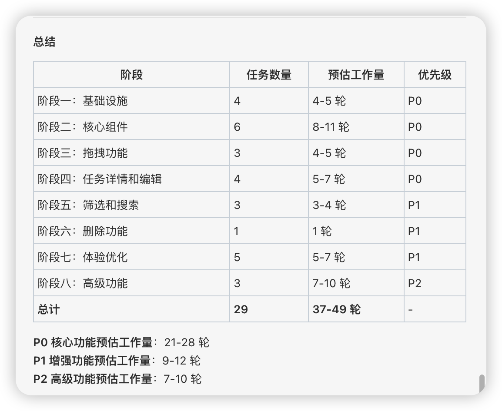
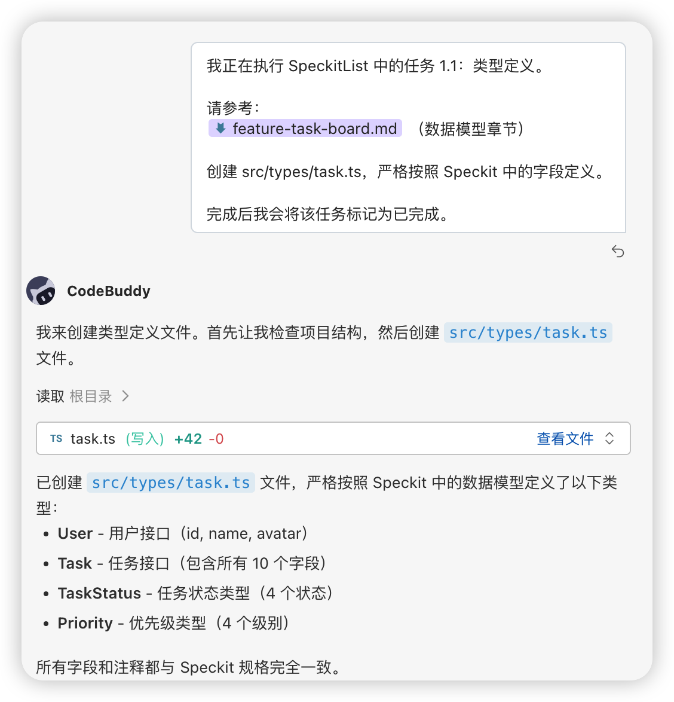

## 一、生成任务清单

在 CodeBuddy 中：

```
请阅读以下 Speckit 文件：
@Files specs/feature-task-board.md
@Files specs/ui-task-board.md

根据 Speckit 的内容，帮我生成一份详细的开发任务清单（SpeckitList），要求：
1. 按依赖关系排序（先做的排前面）
2. 每个任务标注优先级（P0/P1/P2，与 Speckit 中的优先级对应）
3. 每个任务有明确的验收标准
4. 每个任务预估工作量（以"AI 生成轮数"为单位）
5. 用 Markdown Checkbox 格式
```

## 二、期望输出：任务清单

<details style="margin-bottom: 8px;">
<summary style="color: #f57c00; font-weight: 500; cursor: pointer;">AI 应该生成类似以下的清单：</summary>

```markdown
# SpeckitList: 任务看板功能

## Phase 1: 基础设施（P0）

### 1.1 类型定义
- [ ] 创建 `src/types/task.ts`
  - 定义 Task, TaskStatus, Priority 类型
  - 定义 API 请求/响应类型
  - **验收标准：** TypeScript 编译通过，无 any 类型
  - **预估：** 1 轮

### 1.2 API 层
- [ ] 创建 `src/lib/api/task.ts`
  - 实现 getTasks, createTask, updateTask, moveTask, deleteTask
  - 统一错误处理
  - **验收标准：** 所有函数有完整类型注解，能正确发送请求
  - **预估：** 1 轮

### 1.3 自定义 Hook
- [ ] 创建 `src/hooks/useTasks.ts`
  - 实现数据获取、缓存、乐观更新
  - **验收标准：** Hook 返回 data, isLoading, error，支持筛选参数
  - **预估：** 2 轮

## Phase 2: 核心 UI（P0）

### 2.1 任务卡片组件
- [ ] 创建 `src/components/board/TaskCard.tsx`
  - 展示标题、优先级、标签、头像、日期
  - 支持 hover 和拖拽效果
  - **验收标准：** 匹配 UI Speckit 中的卡片规格
  - **预估：** 2 轮

### 2.2 看板列组件
- [ ] 创建 `src/components/board/BoardColumn.tsx`
  - 列标题 + 数量 + 卡片列表 + 新建按钮
  - 支持拖拽放置区域
  - **验收标准：** 卡片可拖入拖出
  - **预估：** 2 轮

### 2.3 看板画布
- [ ] 创建 `src/components/board/BoardCanvas.tsx`
  - 横向排列所有列，支持横向滚动
  - 集成拖拽库（dnd-kit）
  - **验收标准：** 4 列正常展示，可横向滚动
  - **预估：** 2 轮

### 2.4 页面组装
- [ ] 创建 `src/app/board/page.tsx`
  - 组合 Header + Canvas
  - 连接 useTasks Hook
  - **验收标准：** 页面加载数据并展示看板
  - **预估：** 1 轮

## Phase 3: 交互功能（P0）

### 3.1 拖拽排序
- [ ] 实现拖拽逻辑
  - 跨列移动 + 列内排序
  - 乐观更新 + 错误回滚
  - **验收标准：** 拖拽流畅，状态正确更新
  - **预估：** 3 轮

### 3.2 创建任务
- [ ] 实现任务创建流程
  - 内联表单 + 弹窗详细表单
  - 表单验证
  - **验收标准：** 创建后卡片立即出现在对应列
  - **预估：** 2 轮

### 3.3 任务详情
- [ ] 创建 `TaskDetailDrawer` 组件
  - 侧边抽屉展示完整信息
  - 支持编辑和删除
  - **验收标准：** 点击卡片展开抽屉，编辑后保存
  - **预估：** 2 轮

## Phase 4: 增强功能（P1）

### 4.1 筛选与搜索
- [ ] 实现 FilterBar 和 SearchInput
  - 按指派人、优先级、标签筛选
  - 搜索防抖
  - **验收标准：** 筛选结果正确，搜索响应及时
  - **预估：** 2 轮

### 4.2 自定义列
- [ ] 支持添加/删除/重命名列
  - **验收标准：** 列配置持久化
  - **预估：** 2 轮

## Phase 5: 体验优化（P1）

### 5.1 空状态和 Loading
- [ ] 各种状态的 UI 处理
  - **预估：** 1 轮

### 5.2 动画效果
- [ ] 拖拽、过渡、列表动画
  - **预估：** 2 轮

### 5.3 响应式适配
- [ ] 移动端列表视图
  - **预估：** 2 轮

---
**总计预估：25 轮 AI 交互**
```

</details>


模型输出最后总结截图：




## 三、分步执行

有了任务清单后，逐个任务和 AI 对话：

```
我正在执行 SpeckitList 中的任务 1.1：类型定义。

请参考：
@Files specs/feature-task-board.md（数据模型章节）

创建 src/types/task.ts，严格按照 Speckit 中的字段定义。

完成后我会将该任务标记为已完成。
```

上述示例片段截图如下：



每完成一个任务就更新清单：

```markdown
### 1.1 类型定义
- [x] 创建 `src/types/task.ts`（已完成，2024-01-15）
```
