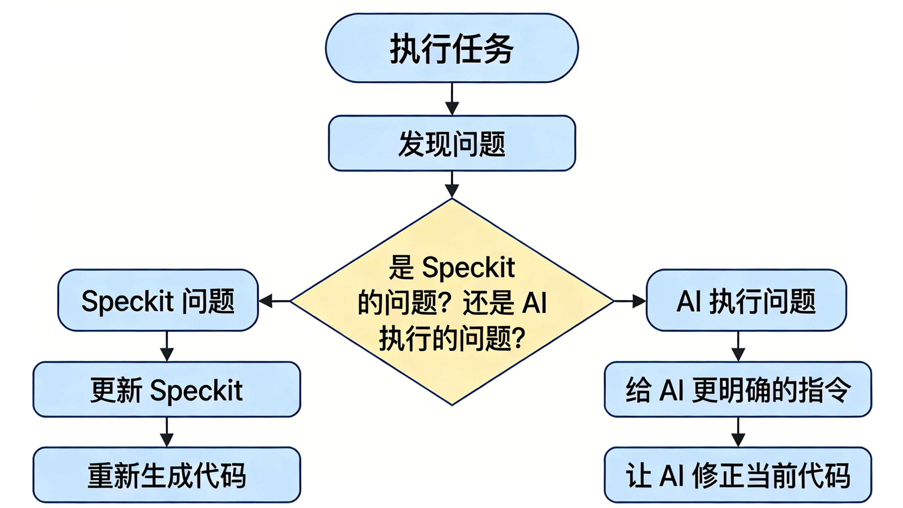

## 一、问题检测：AI 跑偏的信号

| 信号 | 表现 | 原因 |
|------|------|------|
| 自由发挥 | AI 添加了 Speckit 中没有的功能 | Prompt 约束不够 |
| 前后矛盾 | 新生成的代码和之前的不兼容 | 上下文丢失 |
| 过度设计 | 简单功能搞出复杂架构 | 方案边界没收住 |
| 忽略约束 | 不符合 Speckit 中的非功能需求 | 缺少明确的非功能约束与验收口径 |

## 二、纠偏策略：修改 Speckit，而不是修改代码

<details>
 <summary style="color:#0066CC; font-style:bold">传统方式（修改代码）：</summary>


</details>

<details>
 <summary style="color:#0066CC; font-style:bold">自愈式开发（修改 Speckit）：</summary>


</details>

## 三、实操示例

### 场景
AI 在实现拖拽时用了 react-beautiful-dnd（你想用 @dnd-kit）。

**不推荐：手动改代码**
```
// 把 AI 的 react-beautiful-dnd 代码手动改成 dnd-kit
// ... 改了 200 行 ...
// 结果：下次让 AI 改东西时，它还是按 react-beautiful-dnd 来
```

**推荐：更新 Speckit**

更新 `specs/feature-task-board.md`，添加技术选型约束：

```markdown
## 技术选型约束
- 拖拽库：必须使用 @dnd-kit/core + @dnd-kit/sortable（不用 react-beautiful-dnd）
- 原因：更好的 TypeScript 支持和更小的包体积
```

然后重新生成：

```
Speckit 中的技术选型已更新，请重新看一下：
@Files specs/feature-task-board.md

然后重新实现任务 3.1（拖拽排序），使用 @dnd-kit 而不是 react-beautiful-dnd。
```

## 四、Speckit 的动态更新流程

